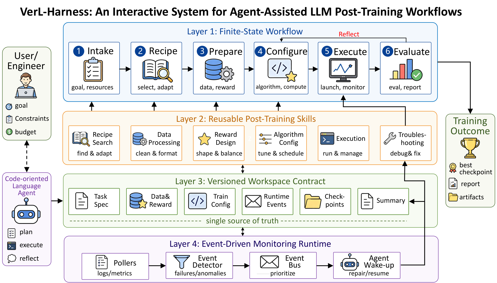

# verl-harness

A markdown-driven agent harness that walks an LLM through a full
[verl](https://github.com/volcengine/verl) training run — from "I want
GRPO on gsm8k with Qwen3-4B" to a trained checkpoint and a structured
report.



Every state under `states/` and every skill under `skills/` is an
instruction file the harness runtime reads and executes. `harness/` is
the self-contained runtime — a multi-backend LLM driver with a tool
loop and workspace-contract enforcement — that owns the FSM
end-to-end. Training itself is verl.

`states/*.md` is the single source of truth for control flow. Validate the
state graph and its terminal contracts after every spec change:

```bash
python tools/validate_harness.py .
```

## FSM

```
train: intake → locate_recipe → configure_algorithm → prepare_data ⇄ generate_preprocess
              → configure_reward → select_compute → provision_env → sanity_rollout
              → launch_training → monitor_training → summarize → [reflect] → finalize

refine: summarize → reflect → configure_algorithm   (opt-in closed loop; bounded
        by the declared `**Loop:** max_iterations` on the back-edge)

post-train: intake → run_generate → [run_eval] → finalize
            intake → run_eval → finalize

resume: intake → monitor_training | launch_training
```

Three branching axes:

| axis | what the user picks | what the harness does |
|---|---|---|
| **algorithm** | `ppo` / `grpo` / `sft` / `distill` / … | searches `examples/<algo>_trainer/` and `recipe/<algo>_trainer/` in the verl checkout; falls back to `python -m verl.trainer.main_<algo>`. No curated trainer registry — halts honestly when verl has no match. GRPO loss-mode variants (`gspo`, `cispo`, `gmpo`, `sapo`, `dppo`) are handled inside `algo_grpo` via `policy_loss.loss_mode`, not as peer algorithms. |
| **dataset** | a name (gsm8k, math, …), an HF id, or a parquet path | known names bind to verl's preprocess scripts; unknown HF ids route through `generate_preprocess`, which authors a preprocess script from one of verl's templates. |
| **compute** | `auto` (default), `local-direct`, `local-slurm`, `ssh-slurm` | capability probes (`gpu.access` / `slurm.access` / `ssh.exec`) pick a target. |

See `task-overview.md` for the full diagram (resume / generate / eval
goals included) and `CLAUDE.md` for editing conventions.

## Layout

```
verl-harness/
├── task-overview.md
├── CLAUDE.md               — editing conventions for anyone (human or agent) modifying the specs
├── states/
│   ├── intake.md                    — dispatches on `goal`: train / resume_monitor / resume_train / generate / eval
│   ├── locate_recipe.md
│   ├── configure_algorithm.md       — applies algo_<name> skill, surfaces algo knobs
│   ├── prepare_data.md
│   ├── generate_preprocess.md
│   ├── configure_reward.md          — picks reward_kind (rule/model/custom/shaped)
│   ├── select_compute.md
│   ├── provision_env.md
│   ├── sanity_rollout.md            — load model, run 1 prompt, run reward fn
│   ├── launch_training.md
│   ├── monitor_training.md
│   ├── run_generate.md              — batch generation (main_generation_server)
│   ├── run_eval.md                  — offline scoring (main_eval; CPU-only)
│   ├── summarize.md
│   ├── reflect.md                   — closed-loop refinement (opt-in, bounded knob deltas)
│   └── finalize.md
├── skills/
│   ├── intake/             — canonical training-intent fields, how to elicit them
│   ├── verl_recipes/       — recipe scoring, direct-module fallback, recipe.md format
│   ├── dataset_registry/   — the ~14 known verl-preprocessable datasets + column conventions
│   ├── dataset_autogen/    — author a verl preprocess script from an HF dataset schema
│   ├── compute_select/     — capability probes (gpu/slurm/ssh) and target selection
│   ├── compute_local/      — local-direct provisioning, launch, monitoring
│   ├── compute_slurm/      — local-slurm provisioning, launch, monitoring
│   ├── compute_ssh_slurm/  — ssh-slurm provisioning, launch, monitoring
│   ├── gpu_budget/         — per-GPU footprint estimate + N_min/N_rec halt-and-advise
│   ├── training_monitor/   — polling cadences, terminal conditions, anomaly patterns, progress parsing (+ watch_poller.py)
│   ├── reward_rule/        — built-in deterministic rewards
│   ├── reward_model/       — pre-trained reward-model scoring
│   ├── reward_custom/      — author a custom_reward_function.path file
│   ├── reward_shaping/     — composing format + correctness + length rewards
│   ├── algo_ppo/           — PPO-only knobs (critic, value_loss, kl_ctrl)
│   ├── algo_grpo/          — GRPO group-rollout knobs (n, norm_adv_by_std, policy_loss.loss_mode)
│   ├── algo_sft/           — SFT knobs (packing, chat template, dynamic batch)
│   ├── algo_distill/       — on-policy distillation (teacher + distill loss)
│   ├── algo_dpo/           — DPO handling (not first-class in verl)
│   ├── algo_rm/            — RM training (not first-class in verl)
│   ├── run_generate/       — main_generation_server CLI + pitfalls
│   ├── run_eval/           — main_eval CLI + reward fn integration
│   ├── builtin-tools/      — filesystem / shell / web tools used by every state
│   └── global/             — honesty principle, scope discipline, state-log contract
├── harness/                — first-party runtime: multi-backend LLM driver + tool loop + FSM contract enforcement
├── tools/                  — FSM validator (`validate_harness.py`) and small fallback utilities
├── runs/                   — per-execution workspace dirs (gitignored)
└── web/                    — sibling Python package: `verl-harness-web` live dashboard
```

## Runtime

```bash
uv run --project harness verl-harness-runtime . \
  --intent "GRPO on gsm8k with Qwen3-4B" \
  --provider anthropic --model claude-sonnet-5 \
  --hitl-channel event      # or `stdio` (default, tty)
```

Built-in provider profiles (`harness/src/harness/providers.yaml`):

| provider           | wire       | key env                |
|--------------------|------------|------------------------|
| **anthropic**      | anthropic  | `ANTHROPIC_API_KEY`    |
| **openai**         | openai     | `OPENAI_API_KEY`       |
| **openrouter**     | openai     | `OPENROUTER_API_KEY`   |
| **deepseek**       | openai     | `DEEPSEEK_API_KEY`     |
| **qwen** (dashscope) | openai   | `DASHSCOPE_API_KEY`    |
| **together**       | openai     | `TOGETHER_API_KEY`     |
| **groq**           | openai     | `GROQ_API_KEY`         |
| **vllm** (local)   | openai     | —                      |

Any OpenAI-compatible endpoint works with a 3-line entry in
`~/.verl-harness/providers.yaml` (deep-merged over the built-ins).

`--hitl-channel event` feeds the dashboard's **approvals** tab;
`stdio` is the tty default. `--no-hitl` is semi-autonomous — four
always-on gates stay honored; see
`skills/global/scientific_principles.md`.

## Dashboard

```bash
uv run --project web verl-harness-web .
```

Opens `http://127.0.0.1:8766`. Six tabs — **submit**, **task**,
**progress**, **workflow**, **terminal**, **approvals** — cover:

- **submit** — form-driven task launch with algorithm / model / dataset
  fields plus a recent-tasks panel; the backend spawns the agent in the
  background and drives the FSM autonomously.
- **task** — three collapsible groups (overview / states / skills) with
  inline Markdown rendering and edit-in-place for `task-overview.md`,
  every `states/*.md`, and every `skills/**/*.md`.
- **progress** — wandb-style panel grid grouped by metric namespace,
  anomaly strip, job card, and (when the run has activated the closed
  loop) a **reflect card** showing iteration / bound, per-iter deltas,
  best checkpoint, `stop_reason`, and inlined `refinement_plan.md` +
  `reflect_report.md`.
- **workflow** — the FSM diagram at three zoom levels (phases · 5 /
  stages · 14 / all · 16).
- **terminal** — raw job-log tail (debug-only).
- **approvals** — one card per pending hand-off point (state / title /
  description / always-on flag) with Approve / Deny / Skip buttons.
  Activates when the runtime is launched with `--hitl-channel event`
  (default is still stdio); a top banner flags pending count on every tab.

See `web/README.md`.

## What it does NOT do

- Modify the verl source tree (the verl repo is read-only from the
  harness's perspective).
- Invent metrics, checkpoints, or success verdicts. A crashed run is
  reported as crashed, with a specific remediation.

## License

Apache 2.0.
